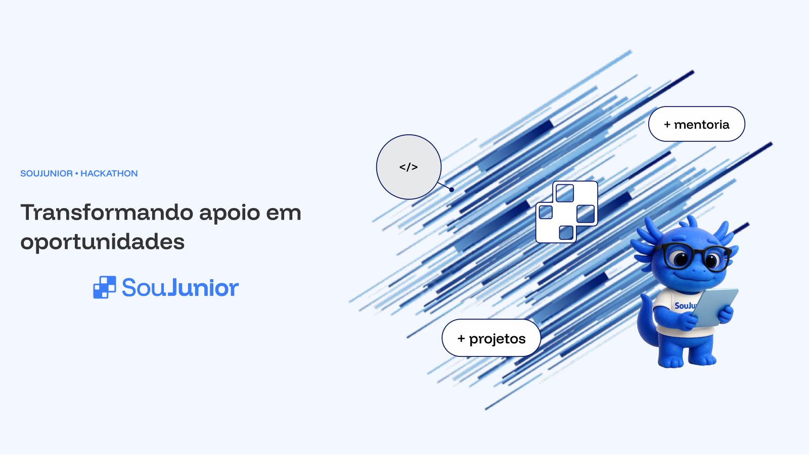

<div align="center">
  
  
  # 🚀 Landing Page · Jasper.C
 
  <p align="center">
    <b>Desenvolvido pela squad <u>Jasper.C</u> para o Hackathon da SouJunior</b>
  </p>
  <p align="center">
    <b>Transformando visitantes em apoiadores ativos da comunidade de transição para júniores.</b>
  </p>
  <p>
    
    
    <a href="LICENSE"></a>
  </p>
  <p>
    
    
    
    
  </p>
  <p>
    <a href="https://soujunior-landingpage-jasperc.netlify.app/"><b>🌐 Ver o site</b></a>
    &nbsp;·&nbsp;
    <a href="https://novo.apoia.se/support/soujunior/new?step=new-support"><b>💙 Apoiar a SouJunior</b></a>
  </p>
</div>

--- 
<details>
<summary><b>📑 Sumário</b></summary>

- [1. Projeto](#Projeto)
- [2. Solução](#Solução)
- [3. Estrutura da Landing Page](#estrutura-da-landing-page)
- [4. Destaques](#Destaques)
- [5. Stack Tecnológica](#stack-tecnológica)
- [6. Arquitetura do Projeto](#arquitetura-do-projeto)
- [7. Equipe — Jasper.C](#equipe--jasper-c)
- [8. Como Executar Localmente](#como-executar-localmente)
- [9. Equipe — Jasper.C](#Equipe-Jasper.C)
- [10. Licença](#Licença)

</details>

---

## Projeto
 
A SouJunior é uma comunidade voltada para profissionais em início de carreira na área de tecnologia, oferecendo mentorias gratuitas, projetos open-source e oportunidades de desenvolvimento profissional.
 
Mantida com o apoio e o engajamento da própria comunidade, a SouJunior busca fortalecer sua sustentabilidade por meio do Apoia.se, permitindo que pessoas contribuam a partir de R$ 2,00 para ajudar na continuidade dessas iniciativas.
 
Neste Hackathon, nossa squad recebeu o desafio de criar uma Landing Page criativa, moderna e persuasiva, capaz de transformar a jornada do visitante e incentivar novos apoiadores.
 
Hoje, a campanha de arrecadação aparece no final de uma página institucional extensa, depois de conteúdos sobre a comunidade, áreas de atuação e depoimentos. Isso gera dois problemas principais:
 
- A página atual não foi estruturada com foco em conversão de apoiadores;
- Não há uma comunicação clara sobre para onde os recursos arrecadados são direcionados.
Para quem está considerando apoiar, entender o impacto da contribuição e como os recursos são utilizados é fundamental para gerar confiança.
 
---
 
## Solução
 
Uma **Landing Page exclusiva para o Apoia.se da SouJunior**, com uma experiência visual, moderna e envolvente, que apresenta a causa, mostra o impacto e explica **com transparência como os recursos são utilizados**.
 
A página combina **storytelling, números reais da comunidade e CTAs estratégicos**, conduzindo o visitante até o apoio (planos a partir de R$ 2/mês) e reforçando que **cada contribuição ajuda a manter iniciativas gratuitas para profissionais juniores**. Quem prefere apoiar de outra forma (parcerias, mentorias, apoio institucional) encontra um **formulário de contato** na própria página.
 
---
 
## Estrutura da Landing Page
 
| Seção | O que entrega |
| :--- | :--- |
| **Header / Navegação** | Logotipo e menu de acesso rápido às seções. No mobile, vira um menu retrátil. |
| **Hero** | Proposta de valor logo no primeiro impacto: título, texto de apoio, ilustração e botões de ação (CTA). |
| **Por que apoiar** | Os três pilares do apoio: infraestrutura, comunidade e experiência prática. |
| **Impacto** | Números da comunidade: membros, apoiadores, pessoas empregadas e mentores ativos. |
| **Como apoiar** | Três planos de apoio (R$ 2, R$ 9,90 e R$ 19,90 por mês) com o que cada contribuição viabiliza, direcionando para o Apoia.se. |
| **FAQ** | Perguntas frequentes em formato de acordeão, sobre como apoiar e para onde vai a contribuição. |
| **Contato** | Formulário para quem quer apoiar de outra forma, com validação dos campos. |
| **CTA final** | Reforço do chamado para apoiar, no fim da jornada. |
| **Footer** | Links da comunidade: Apoia.se, Discord, WhatsApp e GitHub. |
 
---
 
## Destaques
 
- **Responsividade:** layout adaptado para desktop, tablet e mobile, com os planos em carrossel nas telas menores.
- **HTML semântico e acessível:** landmarks (`header`, `nav`, `main`, `footer`), hierarquia de títulos, link "Pular para o conteúdo" e atributos ARIA no menu e no FAQ.
- **Formulário com validação:** impede o envio de campos vazios e mostra as mensagens de erro junto a cada campo.
- **Sem dependências:** apenas HTML, CSS e JavaScript puros, sem frameworks nem etapa de build.
---
 
## Stack tecnológica
 
| Camada | Tecnologia | Propósito no projeto |
| :--- | :--- | :--- |
| **Front-end** | HTML5 · CSS3 · JavaScript (Vanilla) | Estrutura semântica, estilização modular e interatividade |
| **Tipografia** | Funnel Display · Funnel Sans · Inter | Identidade visual da página |
| **Formulário** | Netlify Forms | Recebe as mensagens de contato sem servidor próprio |
| **Versionamento** | Git & GitHub | Controle de versão e colaboração em equipe |
| **Infraestrutura** | Netlify | Hospedagem e deploy contínuo (CI/CD) a cada push |
 
---
 
## Arquitetura do projeto
 
```text
landing-page/
├── assets/
│   ├── icons/            # Ícones utilizados na interface (.gitkeep)
│   └── images/           # Imagens organizadas por seções (FAQ, Hero, CTA, Logos, etc.)
├── css/
│   ├── global.css        # Configurações globais, reset e tipografia
│   ├── style.css         # Estilos específicos da página principal
├── js/
│   ├── donation.js       # Lógica e interatividade para a seção de doações
│   ├── form.js           # Validação e comportamento de formulários
│   ├── main.js           # Ponto de entrada principal dos scripts
│   └── menu.js           # Controle do menu de navegação (ex: menu responsivo/mobile)
├── .gitignore            # Arquivos ignorados pelo controle de versão
├── index.html            # Arquivo HTML principal da página
├── LICENSE               # Licença do projeto
└── README.md             # Documentação do projeto
```
 
---
 
## Como executar localmente
 
O projeto é HTML, CSS e JavaScript puros: **não é preciso instalar dependências nem rodar build**.
 
### 1. Clonar o repositório
 
```bash
git clone https://github.com/soujunior-squad-jasperc/landing-page.git
cd landing-page
```
 
### 2. Abrir o site

1. Instale a extensão [Live Server](https://marketplace.visualstudio.com/items?itemName=ritwickdey.LiveServer).
2. Clique com o botão direito em `index.html` e escolha **Open with Live Server**.
3. O site abre em `http://127.0.0.1:5500/index.html`.
 
### ⚠️ Sobre o formulário de contato
 
O envio das mensagens é feito pelo **Netlify Forms**, que só funciona no site publicado. Em ambiente local, a validação dos campos funciona normalmente, mas o envio não é processado e a página mostra a mensagem de erro.
 
---
 
## 🌐 Deploy
 
O site é publicado na **Netlify**
 
🔗 **[soujunior-landingpage-jasperc.netlify.app](https://soujunior-landingpage-jasperc.netlify.app/)**
 
## Equipe Jasper.C
 
| Participante | Papel na squad | LinkedIn |
| :--- | :--- | :---: |
| **Anelise Paz Bittencourt** | 🎨 QA e UI/UX | [](https://www.linkedin.com/in/abitten/) |
| **Sara França Trindade** | 💻 Front-end | [](https://www.linkedin.com/in/sara0333) |
| **Jade Moreira de Assis Rodrigues** | 💻 Front-end | [](https://www.linkedin.com/in/jade-rodrigues-/) |
| **Joice Ferreira Passos** | 🧭 Mentora Geral | [](https://www.linkedin.com/in/joiceferreirapassos) |
 
---
 
## Licença
 
Distribuído sob a licença MIT. Veja o arquivo [LICENSE](LICENSE) para mais detalhes.
 
<div align="center">
  <sub>Feito pela comunidade, para a comunidade. 💙</sub>
</div>


